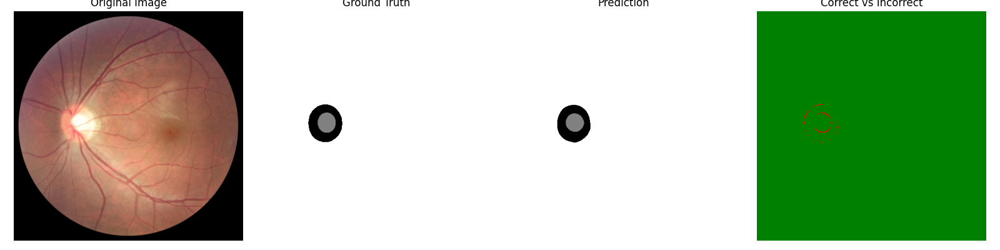

#  Dual-Encoder Network with Contrastive Pretraining and Window Cross Attention for Robust Glaucoma Segmentation

---

##  Overview

The **Unet++** architecture, built on top of PyTorch, to segment retinal images. The project covers the full pipeline from data preprocessing, model training/testing, to result visualization and performance evaluation.

---

##  Features
-  Pretraing for REFUGE2 dataset
-  Preprocessing of REFUGE2 dataset (images + masks)
-  Unet++ model implementation for segmentation
-  Training and testing with performance logging
-  Visualization of predictions vs ground truth
-  Evaluation using standard segmentation metrics

---

## 📁 Project Structure

 ```python 
.
├── pretrain/                   # Pretrain folder
│   ├── data_aug/               # Augementation method for contrastive learning
|   ├── exceptions/
│   ├── datasets/           
|   |   ├── refuge2/  
|   |   |    └── train/           
|   |   |        └── images/    # Images for contrastive learning
|   ├── models
|   ├── run.py
|   ├── simclr.py               # Contrastive learning method
│   └── utils.py                # Tools for save_checkpoint, save_config_file, calculate accuracy
├── SimCLR/                     
│   ├── datasets/               # Dataset (REFUGE2)
│   ├── env/                    # SMP attention method
│   ├── models/                 # Duoble encoder Unet++ and apdative encoder for contrastive learning
│   ├── weights/                # Path to save model
│   ├── seg_train.py            # Train model run this file
│   ├── Segdataloader.py        # Get different dataset
│   ├── testdataset.py          # Evaluation methods
│   └── util.py                 # Tools for load model, getdataset and get dataloader
├── demo.png                    # Demo picture of segmentation
├── requirements.txt                
└── README.md
```
### dataset structure
```python
│   ├── refuge2/          
|   |   ├── train/  
|   |   |    ├── images/        # image
|   |   |    └── mask/          # label
|   |   ├── test/  
|   |   |    ├── images/        # image
|   |   |    └── mask/          # label
|   |   ├── val/  
|   |   |    ├── images/        # image
|   |   |    └── mask/          # label
```
### Setup Environment
RTX 3090
python 3.9.21
pytorch 2.6.0+cu124
```python
conda create -n SimCLR python=3.9
conda activate SimCLR
pip install -r requirements.txt
```
### Pretrain
demo run
```python
python run.py -data ./datasets/refuge2/train/images -dataset-name refuge2 --log-every-n-steps 100 --epochs 500 --batch-size 4
```
### Train the Model
under the directory `./SimCLR` 
go to  `util.py` set your checkopoint `checkpoint = torch.load('Your pretrained weight', weights_only=True)['state_dict']` Line73,59,45
run 
```python
python seg_train.py  --doubleEncoder 1  --freeze 0 --resolution 512 --train_batch_size 4 --backbone timm-efficientnet-b5 --num_train_epochs 250
```
more dome instructions to run is in  `run.py`

### Run Inference and Visualize Results
under the `./SimCLR` directory, goto `testdataset.py` modify encoder_name to coorect backbone for model you test (line 182, 189)
under the `./SimCLR` directory run `testdataset.py`
## Evaluation Metrics
- Dice Coefficient
- Intersection over Union (IoU)
- Precision
- Pixel-wise Accuracy
- recall
- F1
## Example Visualization


## Dataset Download Links
using the following four datasets in experiments:
1. [refuge2](https://refuge.grand-challenge.org/Download/)
2. [ORIGA](https://www.researchgate.net/deref/https://drive.google.com/open?id=1VPCvVsPgrfPNIl932xgU3XC_WFLUsXJR)
3. [G1020](https://www.kaggle.com/datasets/arnavjain1/glaucoma-datasets)
4. [RIMONE](https://github.com/miag-ull/rim-one-dl)


